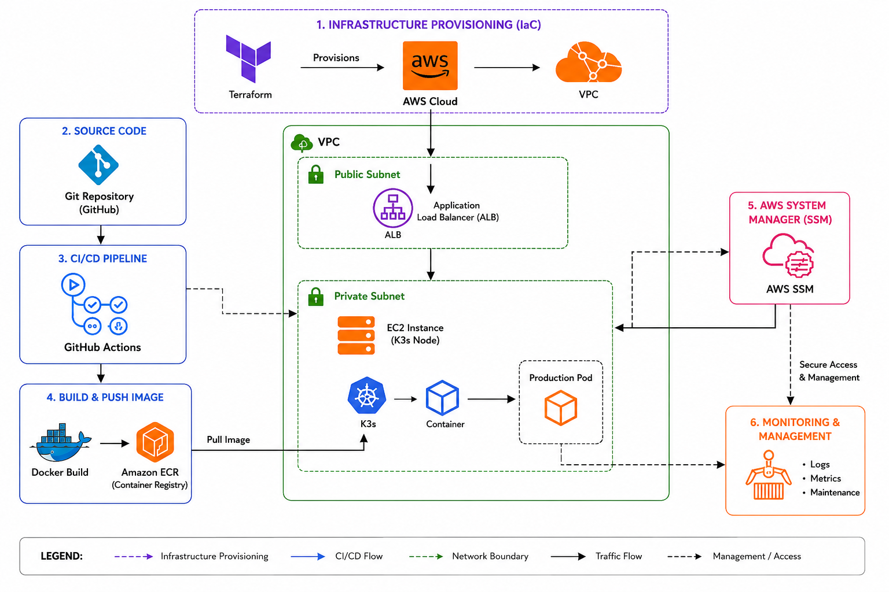

# Production Cloud Platform



A cloud-native production deployment platform built using Terraform, AWS, Docker, Kubernetes (K3s), Amazon ECR, AWS Systems Manager (SSM), and GitHub Actions.


# Table of Contents

- [Production Cloud Platform](#production-cloud-platform)
- [Table of Contents](#table-of-contents)
- [Overview](#overview)
- [Problem Statement](#problem-statement)
- [Solution](#solution)
- [Architecture](#architecture)
- [Technology Stack](#technology-stack)
- [Project Workflow](#project-workflow)
  - [1. Infrastructure Provisioning](#1-infrastructure-provisioning)
  - [2. Application Build](#2-application-build)
  - [3. Deployment](#3-deployment)
- [Infrastructure Components](#infrastructure-components)
  - [AWS VPC](#aws-vpc)
    - [Components](#components)
  - [EC2 Instance](#ec2-instance)
  - [Amazon ECR](#amazon-ecr)
  - [AWS Systems Manager](#aws-systems-manager)
- [CI/CD Pipeline](#cicd-pipeline)
- [Challenges Solved](#challenges-solved)
  - [Challenge 1: Kubernetes Image Pull Failure](#challenge-1-kubernetes-image-pull-failure)
    - [Problem](#problem)
    - [Root Cause](#root-cause)
    - [Solution](#solution-1)
  - [Challenge 2: Dynamic Infrastructure](#challenge-2-dynamic-infrastructure)
    - [Problem](#problem-1)
    - [Solution](#solution-2)
  - [Challenge 3: Secure Deployment](#challenge-3-secure-deployment)
    - [Problem](#problem-2)
    - [Solution](#solution-3)
  - [Challenge 4: Automated Kubernetes Updates](#challenge-4-automated-kubernetes-updates)
    - [Problem](#problem-3)
    - [Solution](#solution-4)
- [Results](#results)
- [Project Structure](#project-structure)
- [Deployment Steps](#deployment-steps)
- [Future Improvements](#future-improvements)
- [Author](#author)
# Overview

This project demonstrates a complete DevOps deployment pipeline that automatically builds, stores, and deploys containerized applications on AWS.

The entire infrastructure is provisioned using Terraform and application deployments are automated through GitHub Actions and Kubernetes.

---

# Problem Statement

Traditional application deployment often faces several challenges:

- Manual server provisioning
- Environment inconsistency
- Deployment downtime
- Difficult application updates
- Lack of deployment automation
- Managing container images manually
- Secure remote deployment without SSH access

These issues make deployments slower, error-prone, and difficult to scale.

---

# Solution

To solve these problems, a fully automated cloud deployment platform was built.

The solution provides:

- Infrastructure as Code using Terraform
- Containerized application deployment using Docker
- Centralized image storage using Amazon ECR
- Kubernetes orchestration using K3s
- Automated CI/CD using GitHub Actions
- Secure deployment execution using AWS Systems Manager
- Automated application updates through Kubernetes rollouts

---

# Architecture

The deployment architecture consists of:

```text
Developer
   |
Git Repository
   |
GitHub Actions
   |
Docker Build
   |
Amazon ECR
   |
AWS Systems Manager
   |
EC2 Instance
   |
K3s Cluster
   |
Production Pod
```

---

# Technology Stack

| Layer | Technology |
|---------|-----------|
| Cloud Provider | AWS |
| Infrastructure | Terraform |
| Compute | EC2 |
| Containerization | Docker |
| Container Registry | Amazon ECR |
| Orchestration | Kubernetes (K3s) |
| Deployment Automation | GitHub Actions |
| Remote Execution | AWS Systems Manager |
| Networking | VPC, Security Groups |
| Monitoring | CloudWatch |

---

# Project Workflow

## 1. Infrastructure Provisioning

Terraform automatically creates:

- VPC
- Public Subnet
- Internet Gateway
- Route Tables
- Security Groups
- EC2 Instance
- IAM Roles
- Amazon ECR Repository

---

## 2. Application Build

When code is pushed to GitHub:

1. GitHub Actions starts automatically
2. Docker image is built
3. Image is tagged
4. Image is pushed to Amazon ECR

---

## 3. Deployment

After pushing the image:

1. GitHub Actions calls AWS SSM
2. AWS SSM executes deployment commands
3. Kubernetes secrets are updated
4. Deployment manifest is applied
5. K3s pulls the latest image from ECR
6. New pod is created automatically

---

# Infrastructure Components

## AWS VPC

Provides network isolation for cloud resources.

### Components

- VPC
- Public Subnet
- Internet Gateway
- Route Table

---

## EC2 Instance

Hosts:

- K3s Kubernetes Cluster
- Application Pods

---

## Amazon ECR

Stores Docker images securely.

Benefits:

- Central image repository
- Version management
- Secure image distribution

---

## AWS Systems Manager

Provides secure remote command execution.

Benefits:

- No SSH required
- Secure deployments
- Centralized command execution

---

# CI/CD Pipeline

```text
Git Push
    |
GitHub Actions
    |
Docker Build
    |
Docker Push to ECR
    |
AWS SSM
    |
kubectl apply
    |
K3s Deployment
    |
Production Pod Running
```

---

# Challenges Solved

## Challenge 1: Kubernetes Image Pull Failure

### Problem

Pods were stuck in:

```text
ImagePullBackOff
```

### Root Cause

Kubernetes could not authenticate with Amazon ECR.

### Solution

Created and updated:

```bash
aws-ecr-secret
```

using:

```bash
aws ecr get-login-password
```

---

## Challenge 2: Dynamic Infrastructure

### Problem

EC2 instances change after recreation.

### Solution

GitHub Actions dynamically discovers running instances using:

```bash
aws ec2 describe-instances
```

before deployment.

---

## Challenge 3: Secure Deployment

### Problem

Avoid direct SSH access.

### Solution

Used AWS Systems Manager to execute deployment commands securely.

---

## Challenge 4: Automated Kubernetes Updates

### Problem

Manual deployment updates.

### Solution

Implemented:

```bash
kubectl rollout restart deployment production-app
```

for automatic updates.

---

# Results

Successfully achieved:

- Automated Infrastructure Provisioning
- Automated Docker Image Build
- Automated Image Push to ECR
- Automated Kubernetes Deployment
- Automated Application Updates
- Secure AWS-Based Deployment
- End-to-End CI/CD Pipeline

Application Status:

```text
Production Pod: Running
Deployment Status: Successful
Image Pull: Successful
CI/CD Pipeline: Working
```

---

# Project Structure

```text
project-root/
│
├── my-terraform-project/
│   ├── main.tf
│   ├── variables.tf
│   ├── outputs.tf
│
├── production-app/
│   ├── Dockerfile
│   ├── app.js
│   └── package.json
│
├── k8s/
│   ├── deployment.yaml
│   └── service.yaml
│
├── .github/
│   └── workflows/
│       └── deploy.yml
│
└── README.md
```

---

# Deployment Steps

```bash
git clone <repository>
```

```bash
terraform init
```

```bash
terraform plan
```

```bash
terraform apply
```

```bash
git push origin main
```

GitHub Actions will automatically:

- Build Docker Image
- Push Image to ECR
- Deploy to Kubernetes

---

# Future Improvements

- Application Load Balancer (ALB)
- Private Subnet Deployment
- Multi-AZ Architecture
- Horizontal Pod Autoscaling
- Prometheus Monitoring
- Grafana Dashboards
- HTTPS with ACM
- ArgoCD GitOps Deployment

---

# Author

Abhishek B

Cloud & DevOps Engineer Project

Built using AWS, Terraform, Docker, Kubernetes, GitHub Actions, and Amazon ECR.